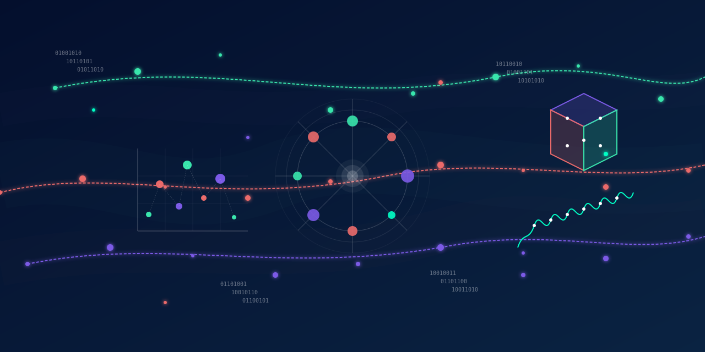

<h1 align="center">Hello Data Universe 👋 – Where every byte tells a story! 📊✨ Nabiha Tasnim Orchi here...</h1>
<h3 align="center">A data wizard conjuring insights from the vibrant shores of Bangladesh, where every dataset tells a story waiting to be discovered. 🇧🇩✨📊</h3>

# 💫 About Me:
🔭 I’m currently working on **Story telling through Dashboards**

- 📫 How to reach me **nabihaorchi@gmail.com**

## 🌐 Socials:
<h3 align="left">Connect with me:</h3>

# 💻 Tech Stack:
                                   
# 📊 GitHub Stats:
 
 

<picture>
  <source media="(prefers-color-scheme: dark)" srcset="https://raw.githubusercontent.com/NabihaOrchi/NabihaOrchi/output/github-snake-dark.svg" />
  <source media="(prefers-color-scheme: light)" srcset="https://raw.githubusercontent.com/NabihaOrchi/NabihaOrchi/output/github-snake.svg" />
  
</picture>

  

###

 

  

###

<!-- Proudly created with GPRM ( https://gprm.itsvg.in ) -->
